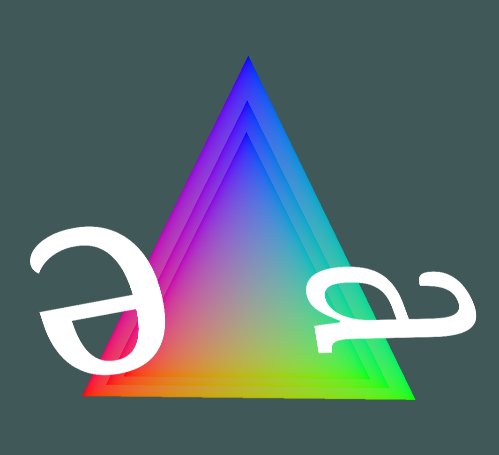

# Quadratic bezier in webgl

Antialiased rendering of quadratic bezier paths using a technique from [medium post by Evan Wallace](https://medium.com/@evanwallace/easy-scalable-text-rendering-on-the-gpu-c3f4d782c5ac).

In the demo the technique has been applied only to the letter shapes. Those are embedded in 3d environment with depth buffer.

